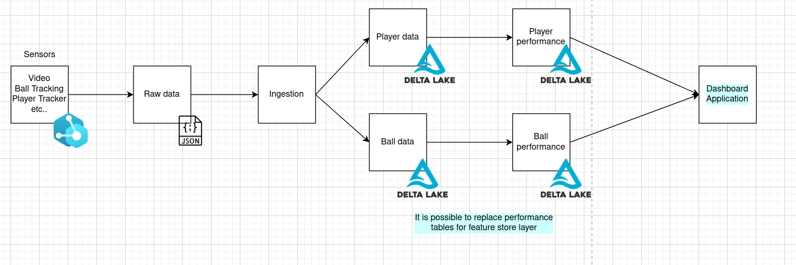

# Batch Task

**Goal** of this task was to load, ingest and aggregate the historical data from the chosen match.

The high level diagram of this solution is described by the figure below.

The user can run this solution in two ways:

1. Run the solution with help of `jupyter` notebooks
2. Run the solution with help of `shell`.

If one wants to understand the whole process, I strongly recommend to first look on the `jupyter` notebooks, where is described in each cell the whole process. The `shell` solution is just copy paste solution from the `jupyter` jupyter notebooks.

At last, there is `utils.py`, which includes all necessary helper functions:

* `plot_ptich` for pitch plotting
* `read_config` for configuration reading
* `init_spark_session` for spark session initializing
* `ball_inside_box` check if the ball is inside the box. It is also possible to check if the ball is in the field.
* `check_throw_corner` check if there is a throw-in or corner

## Solution with jupyter notebook

The solution in `jupyter` notebook can be found:

* `load_save_unified_data.ipynb` is responsible for loading the raw match data and make some unecessary transformations. Then the dataset is saved as `delta` table.
* `player_ball_performance.ipynb` is responsible for loading the unified dataset and make the desired aggregations.

Again, I recommend to look on this files, to understand what is going on, if the one will decide to run a `shell` solution.

**The most important is the order of the execution of the solution**:

1. Run  `load_save_unified_data.ipynb`
2. Run `player_ball_perfromance.ipynb`

## Solution with python scripts

The solution in `python` scripts can be found:

* `load_save_unified_data.py` is responsible for loading the raw match data and make some unecessary transformations. Then the dataset is saved as `delta` table.
* `player_ball_performance.py` is responsible for loading the unified dataset and make the desired aggregations.

**The most important is the order of the execution of the solution**:

1. Run  `python3 load_save_unified_data.py --data_path=<PATH_TO_DATA> --metadata_path=<PATH_TO_METADATA>`
2. Run `python3 player_ball_perfromance.py --data_path=<PATH_TO_DATA> --metadata_path=<PATH_TO_METADATA>`

Each aggregated table will be shown in `stdout`.

