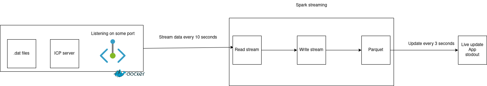

# Stream Task

**Goal** of this task was to simulate a streaming of the data from the particular match and then read this stream and try to make some live aggregations.

The high level diagram of this solution is described by the figure below.



The user can run this solution in two ways:

1. Run the solution with help of `jupyter` notebooks
2. Run the solution with help of `shell`.

If one wants to understand the whole process, I strongly recommend to first look on the `jupyter` notebooks, where is described in each cell the whole process. The `shell` solution is just copy paste solution from the `jupyter` jupyter notebooks.

However, before running one of the solution above, one need to build `Dockerfile` and run the stream process.

`Dockerfile` load the chosen data in the directory (right now hardcoded, but can be parametrized), and run the `icp_server.py` script. This script is responsible for sending the stream of the data to the `localhost:9092`. The following code is necessary:

```sh
docker build -t streaming_process .
```

At last, there is `utils.py`, which includes all necessary helper functions:

* `plot_ptich` for pitch plotting
* `read_config` for configuration reading
* `init_spark_session` for spark session initializing
* `ball_inside_box` check if the ball is inside the box. It is also possible to check if the ball is in the field.
* `check_throw_corner` check if there is a throw-in or corner

## Solution with jupyter notebook

The solution in `jupyter` notebook can be found:

* `read_stream.ipynb` is responsible for reading the stream.
* `aggregate_stream_data.ipynb` is responsible for loading the data from the stream and make some interesting aggregations.

Again, I recommend to look on this files, to understand what is going on, if the one will decide to run a `shell` solution.

**The most important is the order of the execution of the solution**:

1. First run  `docker run -p 9898:9898 streaming_process`
2. Run `read_stream.ipynb`
3. Run `aggregate_stream_data.ipynb`

## Solution with python scripts

The solution in `python` scripts can be found:

* `read_stream_data.py` is responsible for reading the stream.
* `aggregate_stream_data.py` is responsible for loading the data from the stream and make some interesting aggregations.

**The most important is the order of the execution of the solution**:

1. First run  `docker run -p 9898:9898 streaming_process`
2. Run `python3 read_stream_data.py`
3. Run `python3 aggregate_stream_data.ipynb --metadata_path=<PATH_TO_METADATA>`

The live updates should appear in the console.

